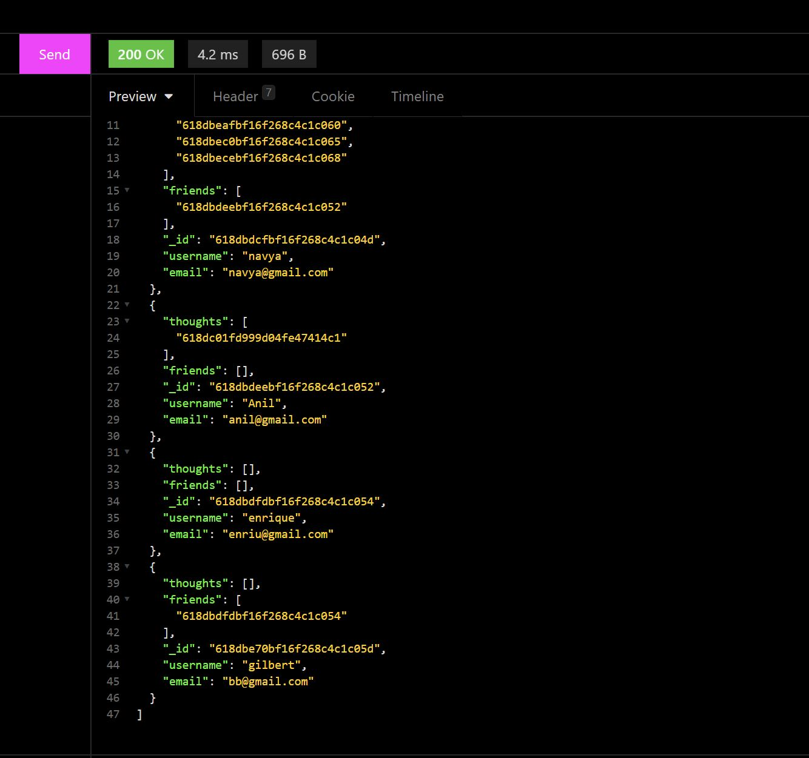
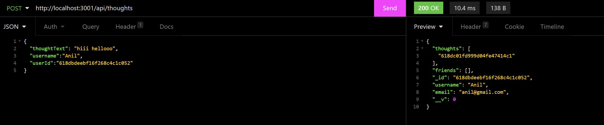

# Social Network API
## Description
This is a social media API build with express.js and mongoose functionality.

## Table Of Content
* [Overview](#overview)
* [Technologies](#technologies)
* [Installation](#installation)
* [Usage](#usage)
* [License](#license)
* [Questions](#questions)

## Overview

This application work with Mongoose ODM using NoSQL(MongoDB) database. No front-end for this application, please see the below video for the functionality demostration in insominia.

Here is the Youtube link for the demostration video.
[CLICK HERE FOR VIDEO](https://youtu.be/vZzopyHRS-w)

## Technologies
This Project used technologies such as:
* [MongoDB ](https://www.mongodb.com/cloud/atlas/lp/try2?utm_content=rlsavisitor&utm_source=google&utm_campaign=gs_americas_uscan_search_core_brand_atlas_desktop_rlsa&utm_term=mongo%20db&utm_medium=cpc_paid_search&utm_ad=e&utm_ad_campaign_id=14291004479&gclid=Cj0KCQjwiNSLBhCPARIsAKNS4_fUniAmR-kPRKB56aHqWpxA--_Zame4g5-LK59C0Bp2dpgv2nJA5TsaArJrEALw_wcB)
* [Mongoose](https://mongoosejs.com/docs/)
* [Express](https://expressjs.com/)
* [Node](https://nodejs.org/en/)
* [Javascript](https://www.javascript.com/)

## Installation

To use this application please clone from this repository.

[Ecommerce backend/lohith-amal](https://github.com/LohithAmal/SM-API)

* goto your terminal type **git clone **
* install dependencies **npm install**
* open mysql shell **npm start**
* app will be running on localhost 3001
* open insominia try **GET PUT POST DELETE** routes

## Usage
The application is used to GET data for each route(users,thoughts,reactions) as well as create, update, and delete data in those routes.

## License

 
This repository is licensed under the MIT license.

## Questions
For any questions,please contact [lohith05amal@gmail.com](mailto:lohith05amal@gmail.com). View all my works [AmalLohith](https://github.com/LohithAmal) 